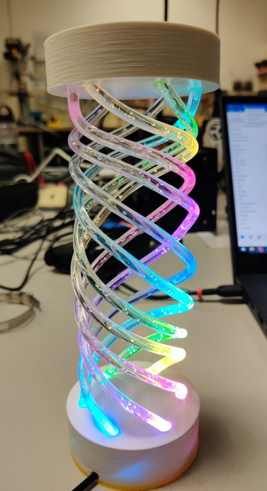
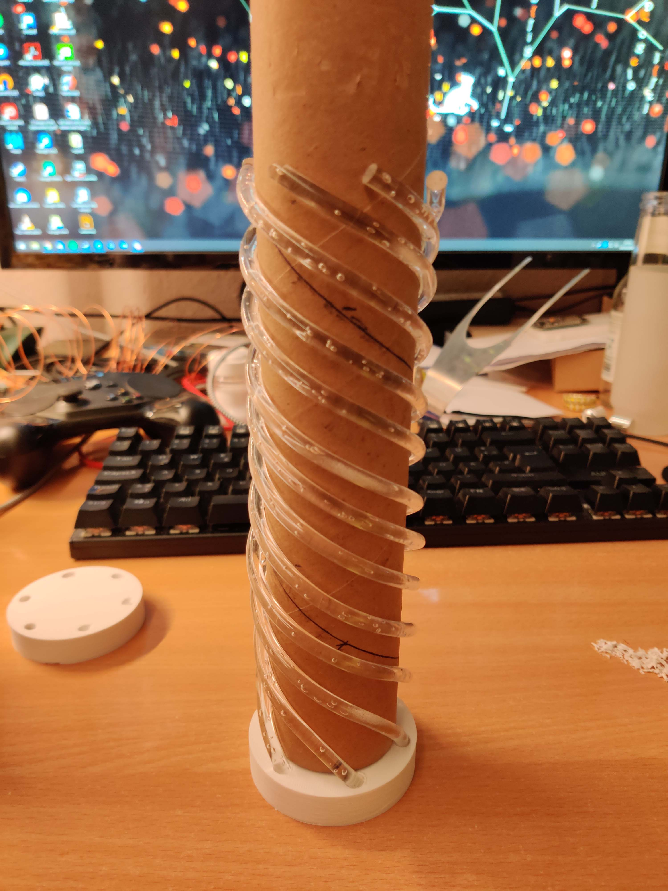
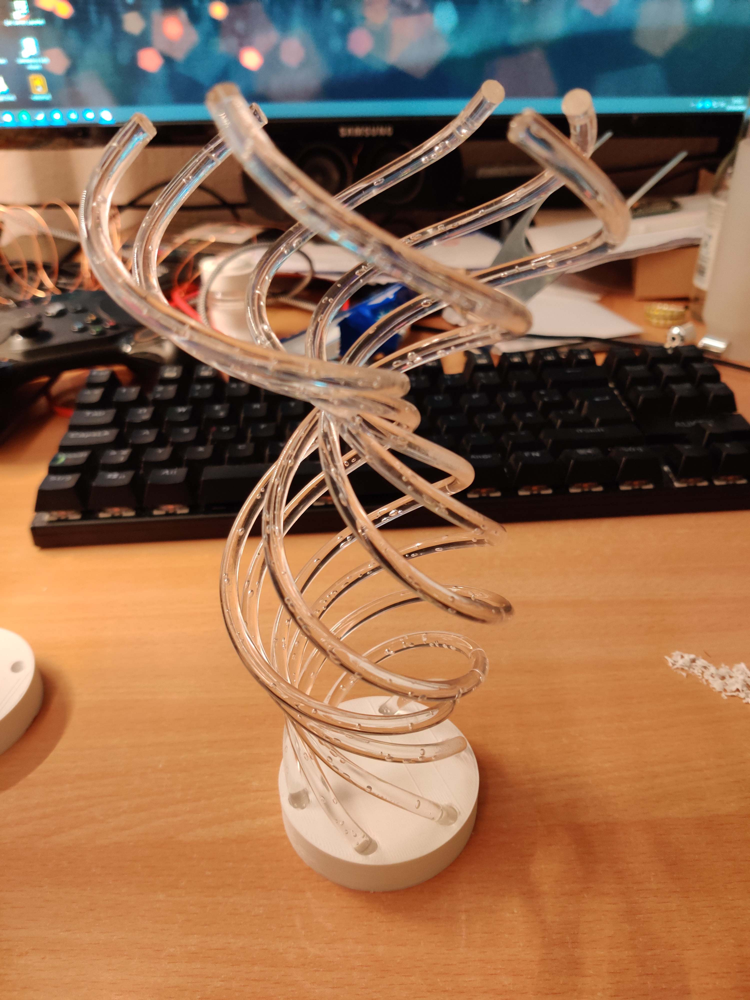

# Helix-Light

Lampe mit LEDs und 6 gebogene Plexiglas-Stangen. Höhe: ~20cm, Durchmesser: 7cm

Die Lampe zeigt eine Regenbogenanimation an. Da nur der ESP8266 verbaut ist (ohne Serial to USB) wird der Code per OTA geflasht. Dafür muss die Lampe mit einem WLAN verbunden sein. Die Lampe verbindet sich automatisch mit dem letzten gespeicherten WLAN. Wenn das gespeicherte WLAN nicht erreichbar ist, öffnet der ESP ein eignes WLAN Netz mit dem Namen Helix und ist komplett rot. Mit diesem WLAN muss man sich verbinden, damit die Daten für das neue WLAN eingebene werden können. Das WLAN Netz bleibt nur 2 Minuten offen. Wenn in dieser Zeit keine neuen WLAN Credentials eingegeben wurde, geht die Lampe in die normale Animation über.  

 

Inside, there is an ESP8266 and 6 LEDs from a 144/m LED strip (WS2812):  
 

Work in Progess Bilder:  
 
 
 

Models in Fusion 360:  
    
  
